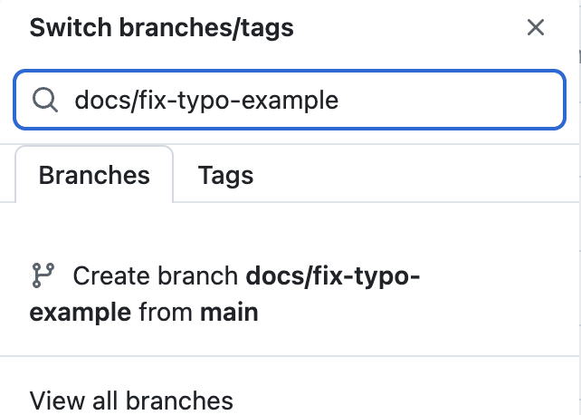

# Contributing Guide

Thank you for wanting to contribute to PhilaCon Valley! This guide covers the workflow for submitting changes.

## Ways to Contribute (No Code Needed)

You don't need to write code to help:

- **Report a bug** — [Open a bug report](https://github.com/philaconvalley/website/issues/new?template=bug_report.md)
- **Request a feature** — [Open a feature request](https://github.com/philaconvalley/website/issues/new?template=feature_request.md)
- **Submit content** — [Submit a project or resource](https://github.com/philaconvalley/website/issues/new?template=content_submission.md)
- **Fix a typo** — Click the pencil icon on any file in GitHub to edit it directly

## Code Contribution Workflow

### 1. Find something to work on

- Browse [open issues](https://github.com/philaconvalley/website/issues)
- Look for issues labeled `good first issue` if you're new
- Comment on an issue to let others know you're working on it

### 2. Fork the repository (first time only)

If you don't have write access to this repo, you'll work from your own copy (a "fork"). Click **Fork** at the top of the [repo page](https://github.com/philaconvalley/website):


This creates a copy under your GitHub account. Clone _your fork_ — not the original — to your computer:

```bash
git clone https://github.com/YOUR-USERNAME/website.git
cd website
```

Already have write access to this repo? You can skip forking and clone it directly instead.

### 3. Set up your environment

See [Getting Started](getting-started.md) for full setup instructions.

### 4. Create a branch

```bash
# Make sure you're on the latest main
git checkout main
git pull origin main

# Create your branch
git checkout -b feature/your-feature-name
```

Use descriptive branch names: `fix/broken-link`, `feature/dark-mode`, `content/new-tutorial`.

You can also create a branch straight from the GitHub UI: open the branch dropdown on the repo page, type a name, and click "Create branch":



### 5. Make your changes

Edit the files you need. Run the dev server to preview:

```bash
npm run dev
```

### 6. Check for errors

Before submitting, make sure the build passes:

```bash
npm run build
```

If this fails, fix the errors before continuing.

### 7. Commit your changes

```bash
git add .
git commit -m "Add dark mode toggle to header"
```

Write commit messages that explain **what** you did, not how — someone skimming `git log` should understand the change without opening the diff.

**Good:**

```
Add social share buttons to project pages

Created ShareButtons.astro component
Added Twitter, LinkedIn, Facebook share links
Styled with Tailwind for consistency
Tested on mobile and desktop
```

This one's good because the first line summarizes the change, and the body says what was actually built and how it was verified.

**Bad:**

```
fixed stuff
```

This one's bad because "stuff" tells the next person nothing — not what broke, what changed, or how to verify it.

If your change is small, a single descriptive line is plenty: `Fix broken link in README`.

### 8. Push and open a PR

```bash
git push origin feature/your-feature-name
```

Then go to [github.com/philaconvalley/website](https://github.com/philaconvalley/website) — you'll see a prompt to open a pull request. Click it and fill in the template.

**Writing a good PR description:**

- **Say what changed and why**, not just what files you touched — "Fixes the mobile nav overlapping the logo on screens under 375px" beats "Update Header.astro"
- **Link the issue** you're closing, e.g. `Closes #5` — this auto-closes the issue when the PR merges
- **Add a screenshot or GIF** for any visual change — reviewers shouldn't have to pull your branch just to see what it looks like
- **List how you tested it** — which commands you ran, which pages you checked, mobile vs. desktop
- **Keep it short** — a few sentences and a checklist beats a wall of text

### 9. Wait for review

- A maintainer will review your PR
- CI must pass (automated checks run on every PR)
- At least one approving review is required
- We may suggest changes — that's normal and collaborative!

## Common Issues and How to Fix Them

**Merge conflicts** — happens when `main` has changed in a way that overlaps with your branch.

```bash
git checkout main
git pull origin main
git checkout feature/your-feature-name
git merge main
```

Git will mark the conflicting sections in the affected files with `<<<<<<<`, `=======`, and `>>>>>>>`. Open each file, decide which version (or combination) is correct, delete the conflict markers, then:

```bash
git add .
git commit
git push origin feature/your-feature-name
```

**`npm run build` fails** — read the error message first; it usually points at the exact file and line. Common causes: a typo in frontmatter, a missing import, or a broken link check. Fix the error and rerun the build before pushing.

**`git push` asks for a password and rejects it** — GitHub removed password auth for Git operations. Use [GitHub Desktop](https://desktop.github.com/) or authenticate the CLI with `gh auth login`.

**Your first commit is rejected or shows the wrong author** — Git needs your identity configured once per machine:

```bash
git config --global user.name "Your Name"
git config --global user.email "you@example.com"
```

**Your branch is missing recent changes from `main`** — you likely branched before someone else's PR merged. Follow the merge conflict steps above (even with no conflicts, `git merge main` will bring your branch up to date).

## Helpful Resources

- [GitHub Docs: Fork a repo](https://docs.github.com/en/pull-requests/collaborating-with-pull-requests/working-with-forks/fork-a-repo)
- [GitHub Docs: About pull requests](https://docs.github.com/en/pull-requests/collaborating-with-pull-requests/proposing-changes-to-your-work-with-pull-requests/about-pull-requests)
- [GitHub Docs: Resolving a merge conflict](https://docs.github.com/en/pull-requests/collaborating-with-pull-requests/addressing-merge-conflicts/resolving-a-merge-conflict-using-the-command-line)
- [Git Basics (official Git book, free)](https://git-scm.com/book/en/v2/Getting-Started-Git-Basics)

## Guidelines

- **Ask questions** — If you're unsure about something, ask in the issue or PR. We're here to help.
- **Keep changes focused** — One PR should do one thing. Don't mix a bug fix with a new feature.
- **Test your changes** — Run `npm run build` before pushing. Check the site visually.
- **Be kind** — Follow our [Code of Conduct](../CODE_OF_CONDUCT.md).

## Where Things Live

| I want to change...                        | Look in...              |
| ------------------------------------------ | ----------------------- |
| Page content or layout                     | `src/pages/`            |
| Reusable UI pieces (header, footer, cards) | `src/components/`       |
| Colors, fonts, or spacing                  | `tailwind.config.mjs`   |
| External URLs (Luma, Formspree, etc.)      | `src/config.ts`         |
| Global styles                              | `src/styles/global.css` |
| Project or resource write-ups              | `src/content/`          |

For more detail, see [Architecture](architecture.md).

## Next Steps

- [Getting Started](getting-started.md) — Set up the project locally
- [Adding Content](adding-content.md) — Add a project or resource
- [Architecture](architecture.md) — Understand the codebase structure
- [Design System](design-system.md) — Work with brand colors and styles
